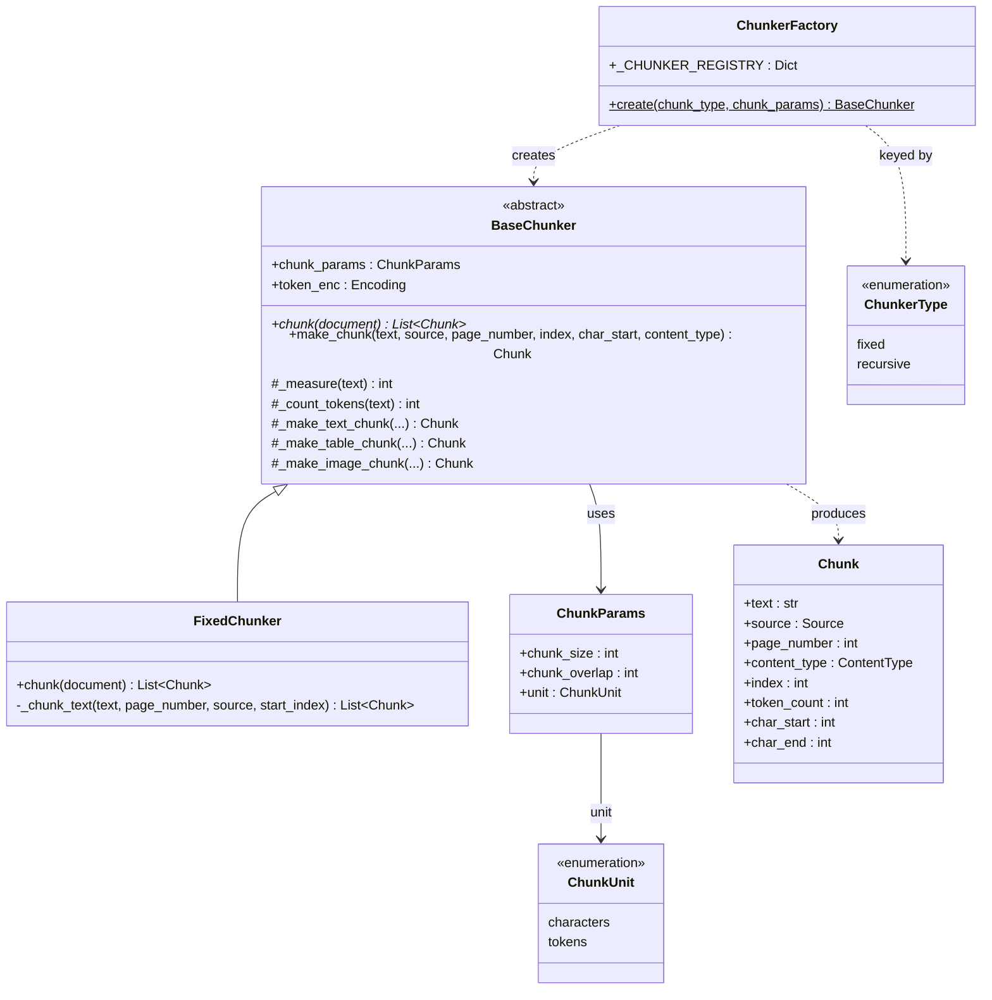
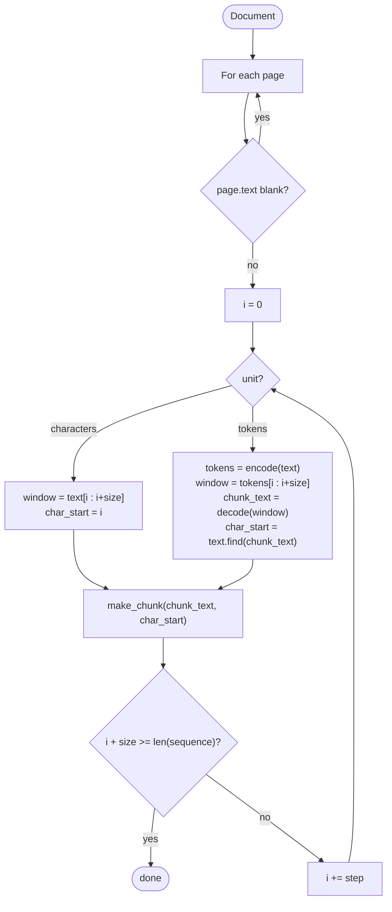

# Chunker

## Setup

Install the core package (tiktoken is included as a base dependency):

```bash
pip install cleave
```

To use a specific chunker:

```python
# Imports
from cleave.chunker.factory import ChunkerFactory
from cleave.schemas import ChunkerType, ChunkParams, ChunkUnit
# Arrange
params = ChunkParams(chunk_size=200, chunk_overlap=20)
chunker = ChunkerFactory.create(ChunkerType.fixed, params)
# Act
chunks = chunker.chunk(document)
```

`chunk_size` and `chunk_overlap` are in **characters** by default. Pass `unit=ChunkUnit.tokens` to measure in tokens (uses tiktoken `cl100k_base`).

---

## Architecture



---

## How Each Chunker Works

### FixedChunker

Splits text into **fixed-size, overlapping windows**. The window slides forward by `step = chunk_size - chunk_overlap` each iteration. The two modes share the same algorithm — they only differ in what the window slides over.



---

#### Character mode example — `chunk_size=10, chunk_overlap=3, step=7`

Window slides over the raw string. Every character, including spaces, counts.

```
text:    The quick brown fox jumps
char:    0123456789012345678901234  (mod 10)

chunk 0: [The quick ]                   i=0,  text[0:10]
chunk 1:        [ck brown f]            i=7,  text[7:17]
chunk 2:               [n fox jump]     i=14, text[14:24]
chunk 3:                      [umps]    i=21, text[21:25]
```

Each space counts as a character. The 3-character overlap between adjacent chunks:
- chunk 0 / chunk 1: `"ck "` (chars 7–9)
- chunk 1 / chunk 2: `"n f"` (chars 14–16)
- chunk 2 / chunk 3: `"ump"` (chars 21–23)

---

#### Token mode example — `chunk_size=5, chunk_overlap=2, step=3`

Text is encoded to token IDs once; the window slides over that list and each window is decoded back to a string. `char_start` is then located by searching the original text.

```
text:    "hello world is a different era"
tokens:  [ 15339 ][ 1917 ][  374 ][  264 ][ 2204 ][ 4325 ][ 11639]
decoded:   hello    world    is      a      diff-   -er-    -ent era

chunk 0: [ 15339  1917  374  264  2204 ]  → "hello world is a diff"    i=0
chunk 1:                [ 264  2204  4325  11639 ... ]  → "a different era"  i=3
```

The overlap (2 tokens) is shared in decoded text - context at boundaries is preserved without re-running the full encode.

---
